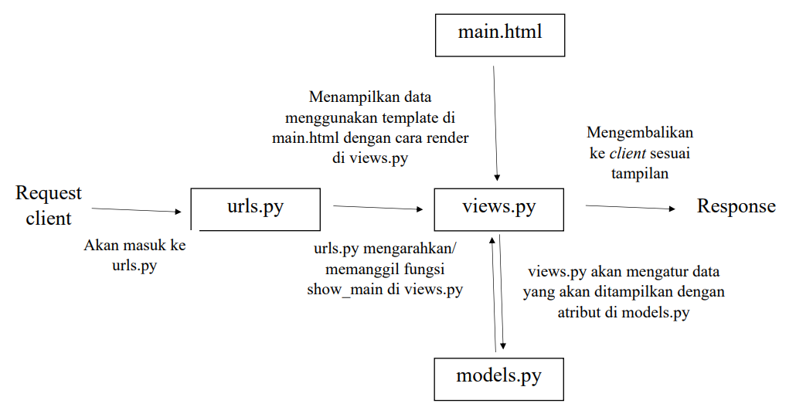
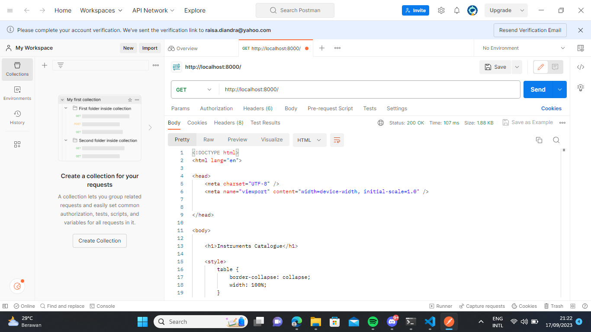
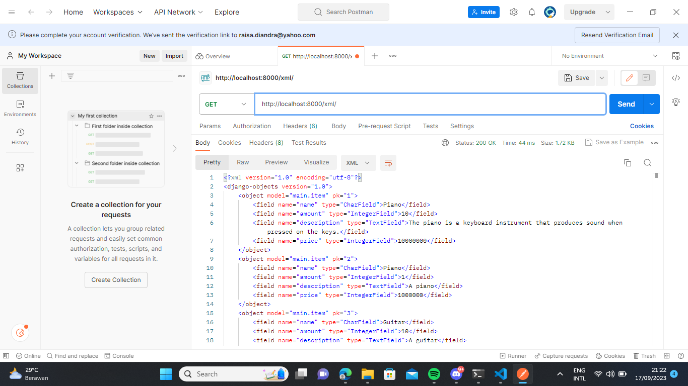
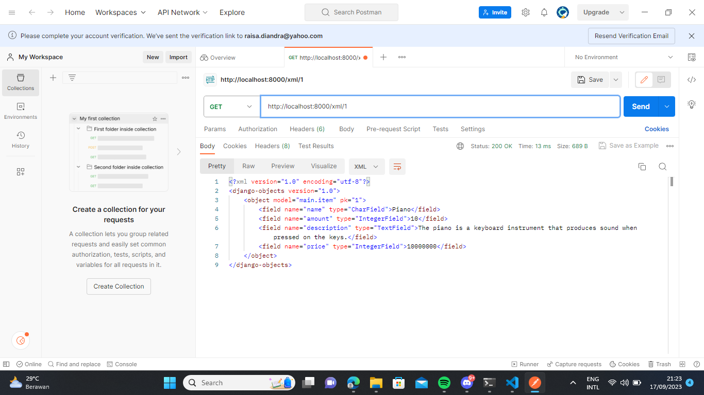
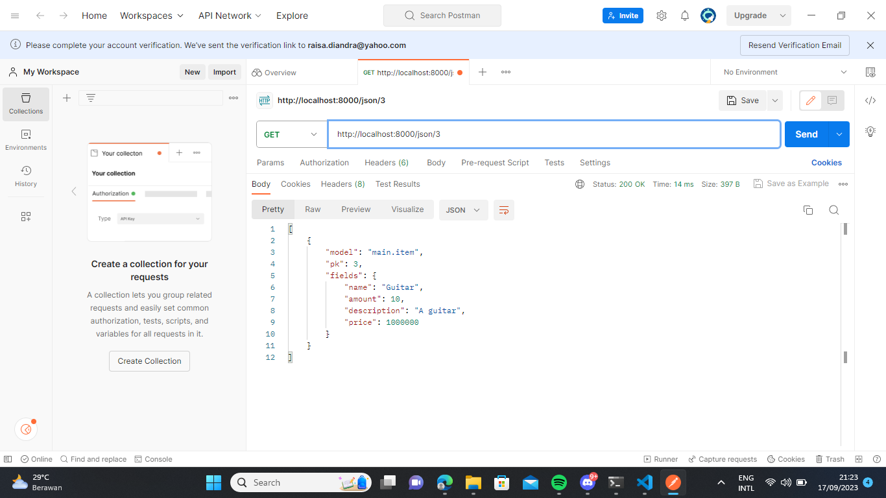

Nama: Raisa Diandra Survijanto
NPM: 2206814545
Kelas: PBP E
Link adaptable: https://instrumentscatalogue.adaptable.app/main/

DAFTAR ISI:
- Jawaban Tugas 2 (line 16)
- Jawaban Tugas 3 (line 95)
- Jawaban Tugas 4 (line 177)

JAWABAN TUGAS 2

1. Jelaskan bagaimana cara kamu mengimplementasikan checklist di atas secara step-by-step (bukan hanya sekadar mengikuti tutorial).

    Berikut adalah cara saya mengimplementasikan tiap langkah dari checklist yang disediakan:

    - Membuat sebuah proyek Django baru.
        Pertama-tama harus membuat direktori lokal dan repositori di GitHub. Setelah membuat keduanya, harus melakukan konfigurasi terhadap direktori agar bisa dihubungkan dengan repositori. Kemudian dihubungkan dengan cara membuat branch dan dihubungkan.
        Kemudian, saya membuat direktori instruments_catalogue sebagai direktori utama tempat saya bekerja dan mengaktivasi virtual environment. Saya membuat file requirements.txt untuk diisi dependencies (komponen agar suatu perangkat lunak dapat berfungsi) dan dipasang. Kemudian saya membuat direktori proyek bernama instrument_catalogue.
        Setelah itu saya mengganti allowed hosts agar aplikasi dapat diakses oleh semua dan menjalankan server. Lalu saya menambahkan file .gitignore agar berkas dalam .gitignore tidak masuk ke versi kontrol Git. Terakhir saya melakukan add, commit, dan push agar progress tersimpan dalam Git.

    - Membuat aplikasi dengan nama main pada proyek tersebut.
        Saya membuat aplikasi baru dengan nama main. Setelah menerapkan perintah "python manage.py startapp main" di commands prompt, muncul suatu direktori baru yang disebut direktori aplikasi dengan nama main.

    - Melakukan routing pada proyek agar dapat menjalankan aplikasi main.
        Saya harus mendaftarkan aplikasi main ke dalam proyek agar terhubung dengan proyek. Aplikasi main ditambahkan kepada INSTALLED_APPS di settings.py pertanda dia sudah didaftarkan.
        Setelah itu, saya harus membuat tempat aplikasi akan berjalan. Saya membuat direktori baru dalam direktori aplikasi main, yang bernama templates. Di sana, saya membuat file html baru bernama main.html. Seluruh isi models saya akan ditampilkan di sana.

    - Membuat model pada aplikasi main dengan nama Item dan memiliki atribut wajib.
        Saya masuk ke models.py dan membuat suatu class baru bernama Item. Kemudian saya menambahkan seluruh atribut wajib pada class tersebut, yaitu name (dengan tipe data character sehingga menggunakan CharField dan maksimal 255 karakter), amount (dengan tipe data integer sehingga menggunakan IntegerField), dan description (dengan TextField). Selain tiga itu, saya menambahkan satu atribut lagi yaitu price (dengan IntegerField). Setelah melakukan hal tersebut, saya melakukan migrasi untuk models agar tersimpan.

    - Membuat sebuah fungsi pada views.py untuk dikembalikan ke dalam sebuah template HTML.
        Dalam views.py, saya memasukkan data yang ingin saya masukkan. Pertama harus import render dari django.shortcuts. Saya juga import Item dari models.py agar dapat membuat item baru di file ini. Kemudian saya menambahkan fungsi show_main. Saya menambahkan data seperti nama aplikasi, nama saya, kelas saya, dan juga satu contoh data yang akan saya masukkan sesuai atribut di models.py.
        Kemudian, data yang sudah saya buat tentang itemnya saya save dan masukkan ke dalam context. Context berisi tiga variabel yaitu name, class, dan item. Ketiga nama variabel itu akan digunakan dalam main.html agar mempermudah. Terakhir, saya merender context dengan URL tujuan main.html agar data bisa digunakan di main.html.
        Dalam main.html, saya mengatur bagaimana saya menginginkan bentuk tampilan website. Saya ingin membuat tabel untuk menampilkan data dari models.py, jadi saya mengatur style tabel. Judul, nama, dan kelas langsung saya tulis (ukuran judul lebih besar), tetapi data saya masukkan di tabel sehingga saya menggunakan <table>.

    - Membuat sebuah routing pada urls.py aplikasi main untuk memetakan fungsi yang telah dibuat pada views.py.
        Pertama harus dilakukan import path dari django.urls (untuk pola URL) dan import show_main dari views.py agar bisa dipakai di file ini. Kemudian saya melakukan konfigurasi routing URL aplikasi main dengan cara membuat variabel urlpatterns dan memasukkan fungsi show_main ke dalam menggunakan path.
        Berkas urls.py pada direktori aplikasi main khusus mengatur aplikasi tersebut. Suatu proyek bisa memiliki lebih dari satu aplikasi sehingga harus dihubungkan juga dengan urls.py di direktori proyek. Ini dapat dilakukan dengan menambahkan include pada import karena include digunakan untuk mengimpor URL aplikasi ke proyek.
        Setelah selesai seluruh langkah

    - Melakukan deployment ke Adaptable terhadap aplikasi yang sudah dibuat.
        Deployment di Adaptable dilakukan dengan cara membuka Adaptable, membuat app baru, memilih menggunakan repositori yang sudah ada, memilih Python sebagai template deployment, PostgreSQL sebagai basis data yang akan digunakan, menyesuaikan versi Python, menambahkan Start Command sesuai nama direktori utama, membuat nama untuk aplikasi, mencentang bagian HTTP Listener on Port, dan terakhir melakukan deploy. Deployment akan berjalan memakan beberapa menit, kemudian setelah selesai, website dapat diakses.
        Apabila saya melakukan perubahan pada directory, saya cukup melakukan add, commit, dan push. Jika sudah tersimpan di repositori GitHub, website di Adaptable akan melakukan deploy ulang secara otomatis, dan hasil yang baru akan terlihat di link yang sama apabila deployment sudah selesai.

    - Membuat sebuah README.md.
        Ini adalah file README.md yang saya buat dan berisi jawaban terhadap seluruh pertanyaan serta tautan Adaptable saya.

2. Buatlah bagan yang berisi request client ke web aplikasi berbasis Django beserta responnya dan jelaskan pada bagan tersebut kaitan antara urls.py, views.py, models.py, dan berkas html.

    Berikut adalah bagan yang saya buat:
    

3. Jelaskan mengapa kita menggunakan virtual environment? Apakah kita tetap dapat membuat aplikasi web berbasis Django tanpa menggunakan virtual environment?

    Virtual environment digunakan agar dependencies yang sudah diatur untuk satu direktori utama ini tidak bertabrakan dengan direktori lainnya. Dengan virtual environment, kita bisa mengatur agar setiap direktori utama dapat memiliki dependencies atau menggunakan packages yang berbeda. Ini berguna apabila kita membuat dua proyek atau lebih yang menggunakan packages yang berbeda.
    Berdasarkan penjelasan di atas, sebenarnya kita bisa membuat aplikasi web berbasis Django tanpa virtual environment, tapi memiliki kelemahan. Kelemahan yang dapat terasa adalah seluruh direktori utama yang kita buat harus menggunakan dependencies dan packages yang sama. Ini akan menyulitkan apabila kita harus membuat dua proyek berbeda yang membutuhkan packages yang berbeda.

4. Jelaskan apakah itu MVC, MVP, MVVM dan perbedaan dari ketiganya.

    MTV adalah Model Template View. Model adalah komponen yang berkaitan dengan data. Template adalah tempat tampilan diatur dan dihubungkan dengan view. View adalah komponen yang mengatur bagaimana data ditampilkan dan interaksi dengan pengguna, menghubungkan antara model dan template.

    Berikut adalah pengertian serta perbedaan antara MVC, MVP, dan MVVM:

    - MVC adalah Model View Controller. Controller adalah komponen yang mengintegrasi model dan view. Seluruh data diambil dari model.

    - MVP adalah Model View Presenter. Presenter adalah komponen yang menerima input pada view, mengirim ke model, dan mengembalikan ke view. Data yang digunakan diminta terlebih dahulu melalui view.

    - MVVM adalah Model View View-Model. View model adalah komponen yang menjadi abstraksi dari view sekaligus menjadi wrapper untuk model agar bisa terhubung, view model bekerja secara dua arah. MVVM mirip dengan MVP, tetapi view model akan memanipulasi data terlebih dahulu baru dikirim kembali ke view.

Referensi Tugas 2:
Lalani, S. (2022, May 9). MVC vs MVP vs MVVM - Top 10 Differences You Should Know. Xperti. https://xperti.io/blogs/mvc-vs-mvp-vs-mvvm/
tereško. (2012, August 9). What are the differences between MVC, MVP and MVVM? Stack Overflow. https://stackoverflow.com/questions/11877575/what-are-the-differences-between-mvc-mvp-and-mvvm 

JAWABAN TUGAS 3

1. Apa perbedaan antara form POST dan form GET dalam Django?

    Berikut adalah perbedaan dari form POST dan form GET:

    - Form POST harus digunakan apabila terdapat perubahan yang berdampak pada keadaan suatu sistem. Form GET digunakan untuk perubahan-perubahan kecil yang tidak mengubah keadaan suatu sistem.

    - Form POST lebih aman berkaitan dengan keamanannya karena data tidak terlihat pada URL. Sementara itu, data pada form GET terlihat pada URL. Maka dari itu, penggunaan password biasanya menggunakan POST.

    - Form POST tidak memiliki batasan panjang data, sementara form GET ada. Maka dari itu, penggunaan form GET harus untuk data yang pendek. Apabila ada data yang panjang, lebih cocok menggunakan form POST.

2. Apa perbedaan utama antara XML, JSON, dan HTML dalam konteks pengiriman data?

    Berikut adalah perbedaan utama antara XML, JSON, dan HTML:

    - HTML digunakan untuk mendesain tampilan suatu website dan menggunakan hyperlinks. Sebagai sarana untuk menampilkan media seperti gambar dan tulisan pada website. HTML bukan digunakan untuk menyimpan data.

    - XML digunakan untuk menyimpan data dan diperuntukkan agar bersifat self-descriptive. Namun, orang awam dapat merasa kesulitan dalam mengerti XML. XML lebih aman dibandingkan JSON. XML menyediakan fitur untuk comment.

    - JSON juga digunakan untuk menyimpan data, tetapi lebih mudah dimengerti oleh orang awam dibandingkan XML. Namun, dibandingkan XML, JSON lebih tidak aman. JSON juga tidak menyediakan fitur comment.

3. Mengapa JSON sering digunakan dalam pertukaran data antara aplikasi web modern?

    JSON sering digunakan dalam pertukaran data antara aplikasi web modern dengan alasan utama bahwa JSON mudah dimengerti oleh orang awam. Selain itu, JSON juga menggunakan bahasa pemrograman JavaScript yang kompatibel dengan aplikasi lain yang juga menggunakan JavaScript. JSON juga menyediakan array (sementara XML tidak) sehingga membantu dalam pemrograman yang membutuhkan array.

4. Jelaskan bagaimana cara kamu mengimplementasikan checklist di atas secara step-by-step (bukan hanya sekadar mengikuti tutorial).

    Sebelum memulai mengimplementasikan checklist, saya mengganti URL program ini dari menggunakan main/ menjadi tidak menggunakan apa-apa sehingga dapat dilihat pada URL program secara langsung. Kemudian, saya membuat file baru base.html pada folder templates di direktori utama yang berfungsi sebagai kerangka untuk halaman web lain pada proyek. Saya menambahkan templates pada kode di settings.py di direktori proyek agar bisa digunakan pada proyek.

    Berikut adalah cara saya mengimplementasikan tiap langkah dari checklist yang disediakan:

    - Membuat input form untuk menambahkan objek model pada app sebelumnya.
        Pertama saya membuat file forms.py di direktori aplikasi yang berisi apa saja yang saya inginkan ada pada input form. Kemudian saya melakukan import pada views.py di direktori aplikasi agar input form dapat berjalan. Pada file tersebut, saya menambahkan fungsi create_item agar dapat menambahkan hasil input secara otomatis ketika input di-submit. Saya juga mengubah kode di fungsi show_main agar data bisa diambil langsung dari database, lalu di-render.
        Selanjutnya saya ke urls.py pada direktori aplikasi dan menambahkan fungsi create_item ke import agar bisa digunakan. Saya juga menambahkan path URL untuk create_item. Setelah itu, saya membuat file baru bernama create_item.html di dalam folder templates di direktori aplikasi, yang berfungsi untuk menampilkan tabel untuk input yang telah di-submit. Saya juga menambahkan tabel di main.html yang menunjukkan setiap kategori input tersebut. Apabila website dibuka, kita dapat melakukan input nama barang, deskripsi, jumlah, dan harga, kemudian melakukan submit dan akan ditampilkan pada tabel.
    
    - Tambahkan 5 fungsi views untuk melihat objek yang sudah ditambahkan dalam format HTML, XML, JSON, XML by ID, dan JSON by ID.
        Fungsi untuk melihat objek dalam format HTML sudah dilakukan di atas.
        Fungsi untuk melihat objek dalam format XML, JSON, XML by ID, dan JSON by ID kurang lebih sama semua. Pertama, pada file views.py di direktori aplikasi, ditambahkan beberapa impor. Selanjutnya, masing-masing membuat fungsi baru, yaitu: show_xml, show_json, show_xml_by_id, dan show_json_by_id. Kemudian, ada variabel data yang menyimpan hasil query seluruh data pada Items. Terakhir, yang akan di-return adalah HttpResponse berisi hasil query yang telah diterjemahkan menjadi format XML/JSON menggunakan serializers.
        Perbedaan antara show_xml dan show_xml_by_id serta show_json dan show_json_by_id adalah untuk yang tanpa ID, mereka akan menampilkan seluruh data yang ada. Namun, yang dengan ID akan menampilkan sesuai dengan ID setiap data (urutan setiap data dikumpulkan).
    
    - Membuat routing URL untuk masing-masing views yang telah ditambahkan.
        Hal yang harus dilakukan adalah masuk ke file urls.py pada direktori aplikasi dan menambahkan semua fungsi yang telah dibuat di import. Kemudian, bisa ditambahkan pada urlpatterns path yang hendak digunakan untuk menuju tiap fungsi.

    - Menambahkan pesan "Kamu menyimpan X item pada aplikasi ini" (dengan X adalah jumlah data item yang tersimpan pada aplikasi) dan menampilkannya di atas tabel data.
        Untuk melakukan hal ini, saya menambahkan variabel baru pada views.py di direktori aplikasi yaitu item_count yang akan berisi jumlah items yang ada (input yang telah dilakukan). Setelah itu, akan di-render. Pada file main.html, saya menambahkan satu line untuk menampilkan jumlah tersebut menggunakan 
 
 dan menambahkan variabel item_count. 

5. Mengakses kelima URL di poin 2 menggunakan Postman, membuat screenshot dari hasil akses URL pada Postman, dan menambahkannya ke dalam README.md.

    Berikut adalah screenshot dari setiap hasil akses URL pada Postman:

    

    

    

    

    

Referensi Tugas 3:
Django. (2023). Form Method Get and Post Difference. Argile.org. https://argile.org/form-method-get-and-post-difference
Sambhav. (2021, February 6). Difference Between HTML, XML and DHTML. GeeksforGeeks. https://www.geeksforgeeks.org/difference-between-html-xml-and-dhtml/
Vivekkothari. (2018, July 19). Difference between JSON and XML. GeeksforGeeks. https://www.geeksforgeeks.org/difference-between-json-and-xml/

JAWABAN TUGAS 4

1. Apa itu Django UserCreationForm, dan jelaskan apa kelebihan dan kekurangannya?

    Django UserCreationForm adalah suatu form yang dapat digunakan untuk melakukan register dalam Django. Pada UserCreationForm, terdapat tiga field standar yang harus diisi, yaitu username, password1 (untuk meminta password), dan password2 (untuk konfirmasi password). Form ini sudah bawaan dari Django.

    Kelebihan dari penggunaan UserCreationForm adalah penerapannya yang cenderung simpel bagi seluruh pihak. User dapat mengerti template dengan mudah. Sementara itu, kekurangan dari penggunaan UserCreationForm adalah field yang ada sebagai default hanya ada tiga. Apabila hendak membuat field baru untuk yang lainnya seperti email, form harus dimodifikasi lebih lanjut.

2. Apa perbedaan antara autentikasi dan otorisasi dalam konteks Django, dan mengapa keduanya penting?

    Autentikasi adalah proses untuk memverifikasi siapa yang hendak mengakses, biasa disebut sebagai login. Sementara itu, otorisasi adalah proses untuk memverifikasi apakah orang tersebut memiliki akses terhadap sesuatu. Keduanya penting karena dapat membantu website terhindar dari akses yang tidak disetujui, pencurian data, sampai penyalahgunaan sistem untuk tujuan yang tidak seharusnya.

3. Apa itu cookies dalam konteks aplikasi web, dan bagaimana Django menggunakan cookies untuk mengelola data sesi pengguna?

    Cookies adalah data di sisi client yang disimpan mengenai informasi tentang siapa yang hendak mengakses, dan disimpan untuk melakukan login. Satu session dimulai ketika client login dan diakhiri ketika client logout. Session cookie disimpan di memori browser dan ketika browser ditutup, cookie tersebut akan terhapus. Tidak bisa digunakan untuk jangka panjang. Django menggunakan cookie agar respon yang dihasilkan oleh server sesuai dengan masing-masing user. Misalnya untuk item yang ditunjukkan, memang item yang dipilih user tersebut dan bukan item milik user lain.

4. Apakah penggunaan cookies aman secara default dalam pengembangan web, atau apakah ada risiko potensial yang harus diwaspadai?

    Secara default, penggunaan cookies dianggap aman karena cookies bukan merupakan kode, melainkan hanya menyimpan data. Cookies juga tidak dapat membaca informasi dari komputer user, hanya dapat membaca data yang dimasukkan user. Namun, harus diwaspadai juga data yang dimasukkan dapat dicuri. Dapat juga dilakukan session forgery atau menggunakan session milik user lain.

5. Jelaskan bagaimana cara kamu mengimplementasikan checklist di atas secara step-by-step (bukan hanya sekadar mengikuti tutorial).

    - Mengimplementasikan fungsi registrasi, login, dan logout untuk memungkinkan pengguna untuk mengakses aplikasi sebelumnya dengan lancar.
        Pertama, saya menjalankan virtual environment. Kemudian, melakukan import di file views.py pada direktori aplikasi dan menambahkan fungsi bernama register untuk melakukan register menggunakan UserCreationForm. Jika form valid, data yang diisi di form disimpan. Setelah itu, saya membuat file baru bernama register.html untuk menampilkan web khusus untuk register. Saya kemudian ke urls.py dan menambahkan fungsi register di import. Terakhir, saya menghubungkan agar bisa diakses melalui URL yang diinginkan di urls.py di direktori yang sama.
        Untuk membuat login dan logout, saya melakukan import untuk authenticate, login, dan logout di views.py di direktori aplikasi. Kemudian, saya membuat fungsi login_user untuk login yang akan masuk ke main apabila user ditemukan dan fungsi logout_user untuk logout untuk melakukan logout. Kemudian, saya membuat file login.html untuk menampilkan web khusus login. Setelah itu, saya ke urls.py di direktori aplikasi, melakukan import fungsi login_user dan logout_user yang telah dibuat, dan menghubungkan dengan URL yang diinginkan.
        Saya melakukan restriksi terhadap halaman main agar yang dapat mengakses halaman main adalah orang yang telah melakukan login. Ini dengan cara menambahkan import login_required pada views.py dan menambahkan sebelum masuk ke main agar hanya orang yang telah login yang bisa mengakses halaman main.
    
    - Menghubungkan model Item dengan User.
        Pertama-tama saya masuk ke models.py di direktori aplikasi dan import User. Kemudian, saya menambahkan atribut baru yaitu user pada model Item dan menggunakan User. Atribut ini menggunakan ForeignKey agar satu item pasti dimiliki satu user. Kemudian, pada fungsi create_item di views.py agar item yang sedang dibuat bisa disimpan sesuai dengan user yang sedang login. Selain itu, saya mengganti context pada fungsi show_main agar nama yang ditampilkan sesuai dengan username yang sedang login. Kemudian saya melakukan migrasi model agar perubahan pada models.py disimpan.

    - Membuat dua akun pengguna dengan masing-masing tiga dummy data menggunakan model yang telah dibuat pada aplikasi sebelumnya untuk setiap akun di lokal.
        Saya melakukan ini setelah menghubungkan Item dan User agar tiap akun memiliki item yang berbeda. Saya membuat dua buah akun pengguna dengan username raisa1 dan raisa2 dengan cara memilih pilihan register. Untuk pengguna raisa1 datanya adalah data yang pada tugas sebelumnya saya masukkan, untuk pengguna raisa2 saya menambahkan data baru. Kedua username dapat digunakan untuk login dan akan menampilkan item masing-masing serta dapat menambahkan item baru.
    
    - Menampilkan detail informasi pengguna yang sedang logged in seperti username dan menerapkan cookies seperti last login pada halaman utama aplikasi.
        Saya masuk ke views.py di direktori aplikasi dan menambahkan beberapa import termasuk datetime untuk mengambil waktu saat ini. Kemudian, saya mengubah kode di fungsi login_user agar dibuat cookie untuk menampilkan last login dengan variabel last_login. Setelah itu, last_login saya tambahkan di context agar bisa dipakai untuk di main.html. Saya juga menambahkan di main.html agar bisa ditunjukkan pada web. Selain itu, saya juga menambahkan kode di fungsi logout_user agar cookie dihapus ketika user melakukan logout.

Referensi Tugas 4:
Java T Point. (2023). Session vs. Cookies| Difference between Session and Cookies - javatpoint. Www.javatpoint.com. https://www.javatpoint.com/session-vs-cookies
OverIQ. (2020, July 27). Django Creating Users using UserCreationForm. OverIQ.com. https://overiq.com/django-1-10/django-creating-users-using-usercreationform/